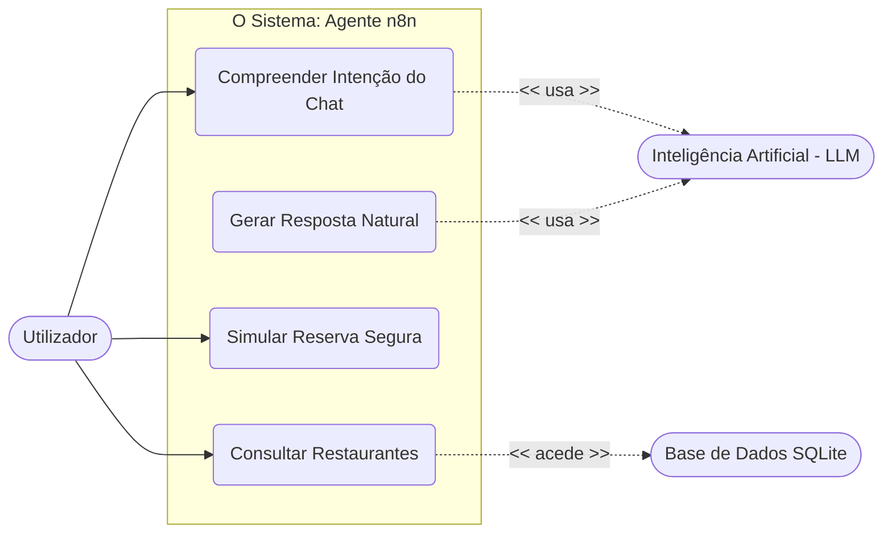
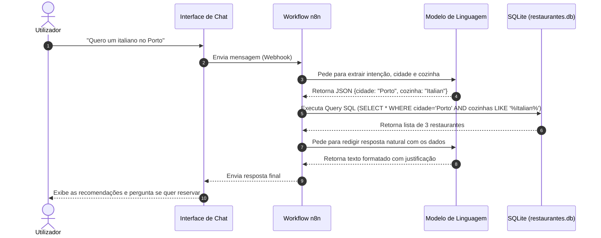
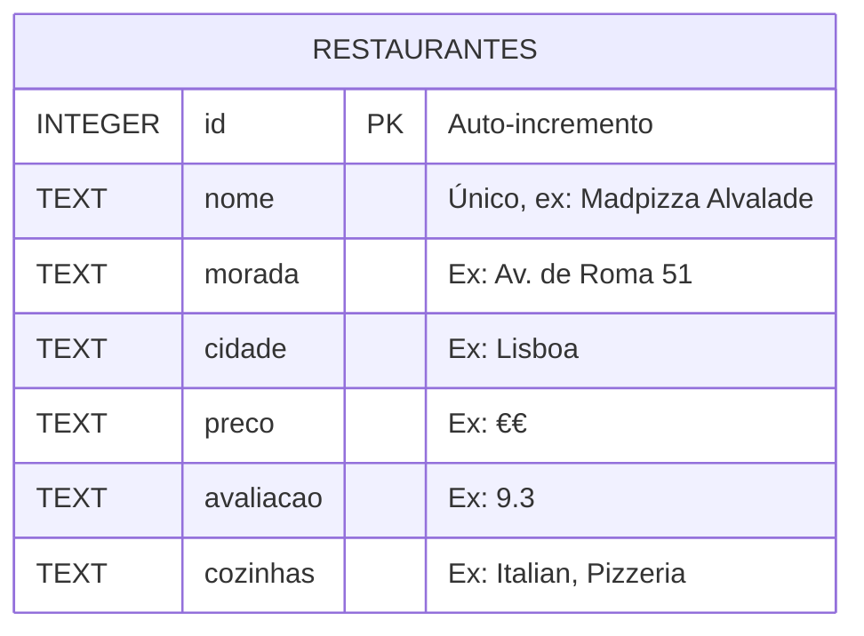

# Diagramas da Arquitetura do Sistema

### 1. Diagrama de Casos de Uso

Este diagrama ilustra de forma macro o que o sistema faz e quem interage com ele.

---

### 2. Diagrama de Sequência (Sequence Diagram)

Este é o diagrama mais importante para o n8n. Ele mapeia o passo a passo da comunicação entre o Utilizador, o n8n, a Base de Dados e o Modelo de Linguagem (LLM).

---

### 3. Modelo Lógico de Dados (ERD)

Estrutura da informação guardada após a extração com o Python.

